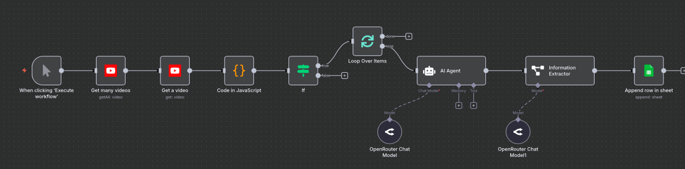

# YouTube Video Summarizer Workflow (n8n)

## Overview
This workflow automates the process of summarizing educational YouTube videos using **n8n**, **OpenRouter AI**, and **Google Sheets**. It is designed to help learners quickly understand the key topics and skills from videos, based on their title, duration, and view count.

## Features
- Fetches the latest YouTube videos matching a specific query.
- Filters videos based on view count and duration.
- Extracts detailed video information including title, views, and duration.
- Uses AI to generate concise summaries and identify key skills taught in the videos.
- Appends the results to a Google Sheet for easy tracking and analysis.

## Workflow Steps
1. **Manual Trigger** – Initiates the workflow when you click “Execute Workflow”.
2. **Get Many Videos** – Retrieves videos from YouTube based on a query and date filter.
3. **Get a Video** – Retrieves full details for each video.
4. **JavaScript Code** – Processes video data, formats duration, and prepares for AI analysis.
5. **Conditional Filter** – Ensures only videos with more than 1,000 views and longer than 5 minutes are analyzed.
6. **Loop Over Items** – Handles multiple videos efficiently in batches.
7. **AI Agent** – Generates a structured summary with video title, topic, skills, and a short description.
8. **Information Extractor** – Parses AI output into structured fields.
9. **Append Row in Google Sheets** – Saves the results to a spreadsheet for tracking.

## Technology Stack
- [n8n](https://n8n.io/) – Workflow automation.
- YouTube API – Fetch video data.
- [OpenRouter AI](https://openrouter.ai/) – Generate video summaries.
- Google Sheets API – Store workflow results.

## Usage
1. Clone this repository.
2. Import the workflow into your n8n instance.
3. Set up your credentials for YouTube, OpenRouter, and Google Sheets.
4. Click **Execute Workflow** to run the workflow and populate your Google Sheet.
